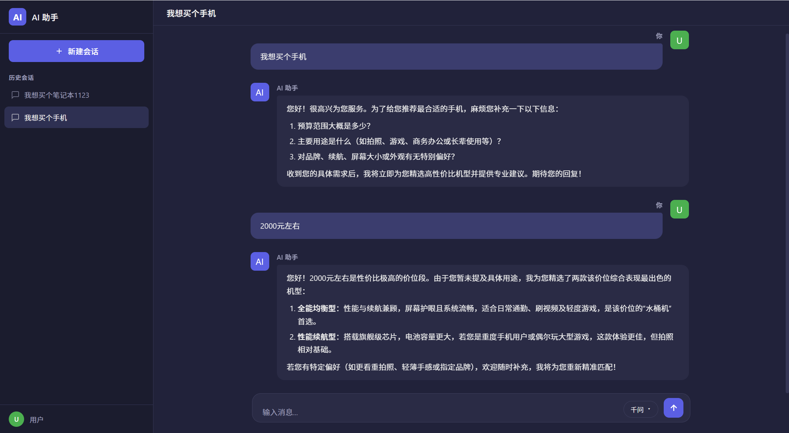
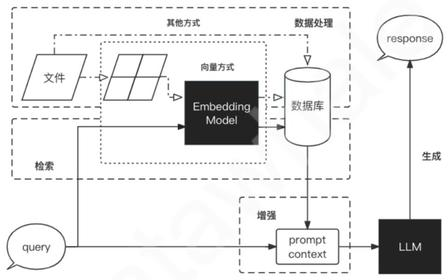
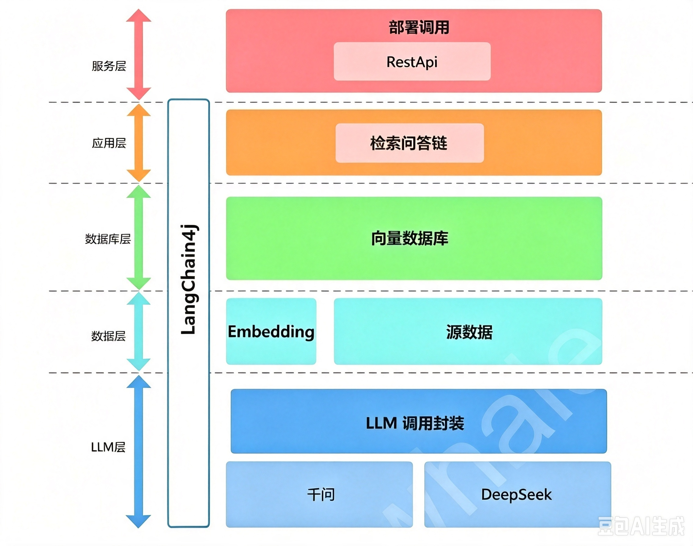
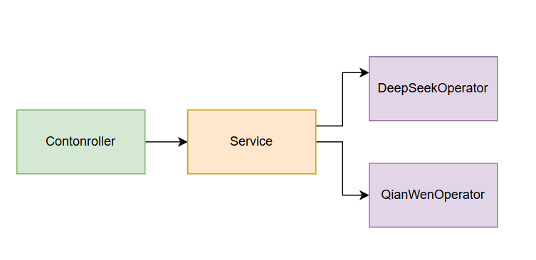
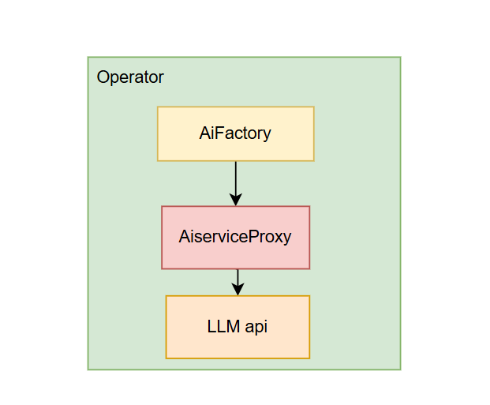
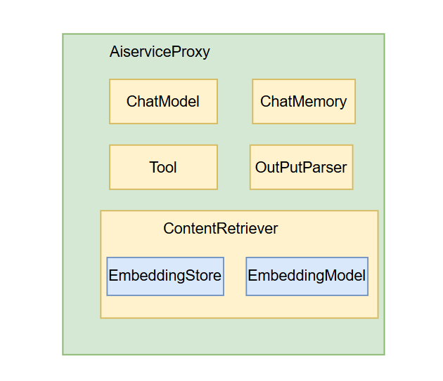

# langchain4j快速开发大模型企业级RAG应用
## 前言
本文为大模型RAG开发学习记录，适配具备一定基础的Java开发人员。本项目实现一个基于大模型的问答助手。
## 功能特性
功能界面

包含功能

会话管理：新建会话、修改会话、删除会话

消息管理：正常对话、历史消息维护

## 一、初识RAG
RAG是一套完整系统，整体工作流程分为**数据处理、检索、增强、生成**四大阶段。

### 1. 数据处理阶段
1. 清洗、加工原始数据
2. 将处理后数据转为检索模型可识别格式
3. 向向量数据库存储向量化后数据

### 2. 检索阶段
将用户输入的问题送入检索系统，从向量库匹配、拉取相关知识库信息

### 3. 增强阶段
对检索到的文档片段做预处理、拼接，构造上下文Prompt，便于大模型理解使用参考资料

### 4. 生成阶段
把携带知识库上下文的完整Prompt送入LLM，由大模型结合参考资料输出最终回答

## 二、RAG快速开发方案
### 开发目标
搭建模拟DeepSeek的对话聊天系统，满足两点核心要求：
1. 至少兼容一款主流大模型
2. 支持自定义私有知识库

### 项目整体架构
项目为个人本地知识库问答助手，基于`LangChain4j`框架开发，核心依赖：LLM API调用、向量数据库、检索问答链。

架构自底向上分为5层：**LLM层 → 数据层 → 数据库层 → 应用层 → 服务层**
> 说明：项目仅用于本地调试，未部署线上服务，省略Nginx反向代理层设计

1. **LLM层**
    通过LangChain4j封装统一ChatModel调用接口，内置两种模型实现：千问、DeepSeek
2. **数据层**
    包含私有知识库原始源文件 + Embedding向量模型；源文本经过Embedding编码后可存入向量数据库
3. **数据库层**
    存储知识库向量数据的向量数据库
4. **应用层**
    基于LangChain4j检索问答链基类二次封装，支持多模型快速切换、开箱即用的知识库检索问答能力
5. **服务层**
    前后端分离设计，本项目使用简易`chat.html`前端页面替代完整前端服务，对外提供RestApi接口

## 三、技术选型清单
| 技术模块 | 选型方案 |
| ---- | ---- |
| LLM开发框架 | langchain4j-open-ai-spring-boot |
| 业务持久化存储 | MongoDB |
| 向量数据库（本地测试） | InMemoryEmbeddingStore（内存向量库） |
| 向量化Embedding模型 | BgeSmallZhV15EmbeddingModel |

## 四、代码分层架构设计

### 4.1 基础Web分层结构
传统后端三层分层：Controller → Service，Service层通过模型操作类适配多厂商大模型

- `DeepSeekOperator`：封装DeepSeek模型所有交互逻辑
- `QianWenOperator`：封装通义千问模型所有交互逻辑

### 4.2 多模型Operator调用链路
通过工厂模式统一管理不同大模型实例，底层封装LLM API请求细节

1. `AiFactory`：大模型工厂，根据配置创建对应模型Operator
2. `AiServiceProxy`：动态代理核心，封装与LLM API交互的全部组件
3. `LLM api`：第三方大模型厂商原生接口

### 4.3 AiServiceProxy核心内部组件
动态代理类集成RAG全链路核心能力，结构如下：

组件说明：
1. 对话基础能力
    - `ChatModel`：大模型对话实例
    - `ChatMemory`：对话历史记忆
    - `Tool`：工具调用扩展
    - `OutPutParser`：LLM输出结果解析器
2. RAG检索核心
    - `ContentRetriever`：文档检索器
        - `EmbeddingStore`：向量存储实例
        - `EmbeddingModel`：文本向量化模型
